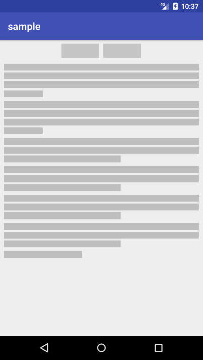

# skeleton-view
a place holder view for android.

## usage

```java
    RecyclerView view = (RecyclerView) findViewById(R.id.container);
    Skeleton.create()
            .append(new TabContainer(1))
            .append(new TextItem(3.2f, 2))
            .append(new TextItem(2.6f, 4))
            .append(new TextItem(0.4f, 1))
            .into(view);
```

